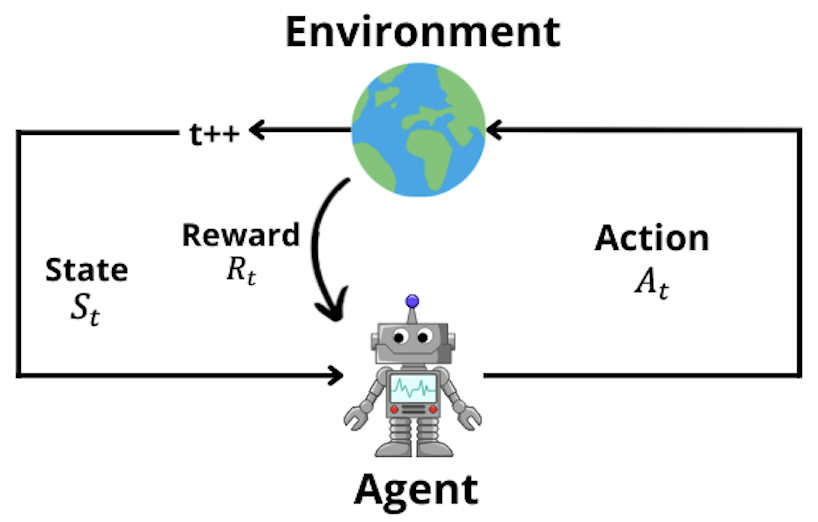

# Reinforcement learning folder 🤖

### folder: transport 🛻
The code for the reinforcement learning framework. 

### folder: snake 🐍
Code out of the scope of this master's thesis. 
The code uses reinforcement learning to learn the optimal moves in the game snake. 

  

